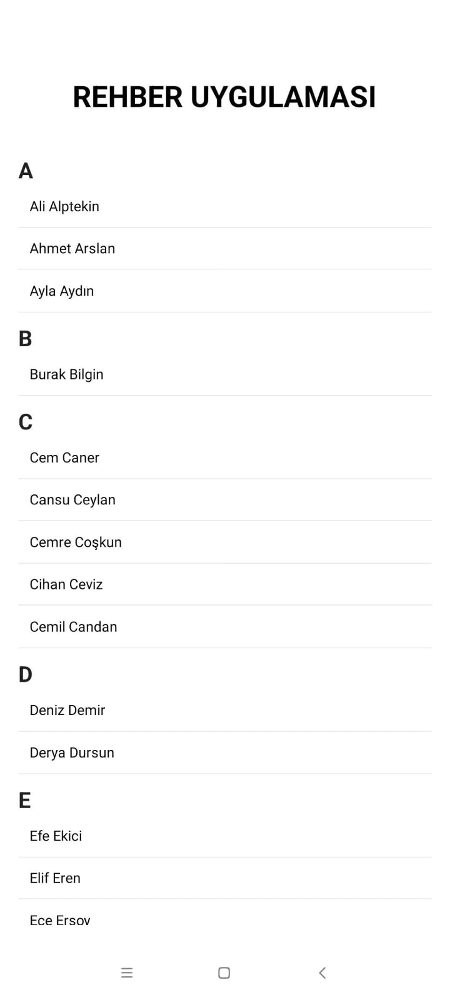

# 📱 Rehber Uygulaması  
  
React Native ile oluşturulmuş basit ama etkili bir rehber uygulamasıdır.  
Kullanıcı isimleri alfabetik olarak sıralanmış bir SectionList yapısı ile listelenir.  
Proje, TypeScript desteğiyle geliştirilmiştir.  
  
  
## 🖼️ Ekran Görüntüsü  
  
> ```markdown  
>   
> ```  
  
  
## 🚀 Özellikler  
  
- 🔠 Alfabetik şekilde sıralanmış kullanıcı listesi  
- 📱 React Native `SectionList` kullanımı  
- 💅 Temiz ve basit arayüz  
- ⚡ TypeScript ile tip güvenliği  
- 📋 Modüler yapı (`UserList` ve `UserListUI` bileşenleriyle)  
  
  
## 🧩 Kullanılan Teknolojiler  
  
 ⚛️ React Native :  Mobil uygulama geliştirme framework'ü 
 💙 TypeScript   : JavaScript için statik tip sistemi 
 📚  Expo        : Hızlı geliştirme ve test ortamı 
 🧱 SectionList  : React Native listeleme bileşeni 