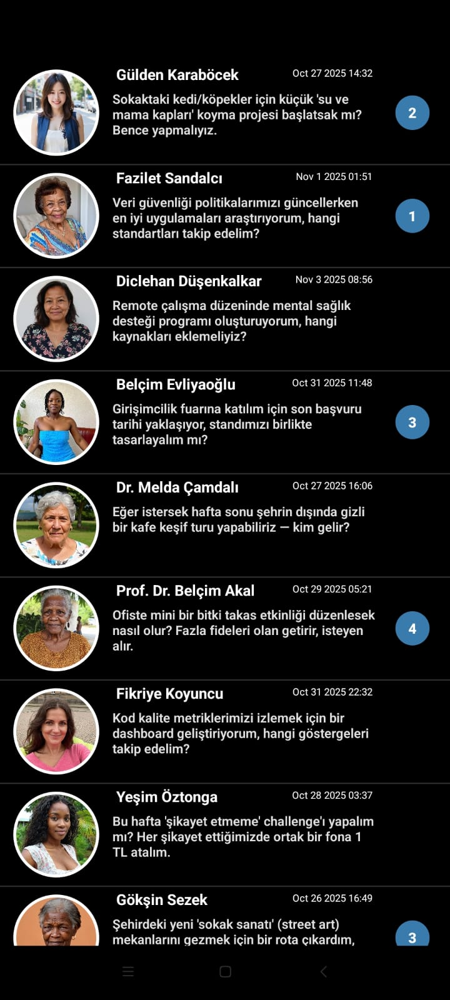

# 📱 WhatsApp FlatList Clone (React Native)

Bu proje, **React Native** öğrenme sürecinde hazırlanmış ufak çaplı bir uygulamadır. Amaç, FlatList yapısını ve faker.js kütüphanesini kullanarak dinamik verilerle bir mesajlaşma arayüzü oluşturmaktır. Uygulama, temel olarak WhatsApp benzeri bir görünüm ve kullanıcı listesi mantığı sunar.

## 🚀 Özellikler

-  **Kullanıcı fotoğrafı, isim** dinamik olarak faker.js ile oluşturulur.  
-  **Mesaj İceriği** Json dosyası ile oluşturup aldığım veriler. (Türkçe veri üretmek için)
-  **Zaman bilgisi** faker.js üzerinden çekilir.  
-  **FlatList** kullanılarak verimli listeleme yapılır.  
-  WhatsApp benzeri sade ve modern arayüz tasarımı.  
-  **React Native StyleSheet** ile özel stil düzenlemeleri.  

## 🖼️ Ekran Görüntüsü

## 🛠️ Kullanılan Teknolojiler

- **React Native (Expo)**
- **faker.js** – Verileri üretmek için  
- **JavaScript / TypeScript**
- **expo-icons** – İkonlar için  

Not : Bu proje, FlatList kullanımı, faker.js ile veri üretimi ve React Native arayüz tasarımına temel bir örnek oluşturmak amacıyla geliştirilmiş güzel bir örnek projedir.
